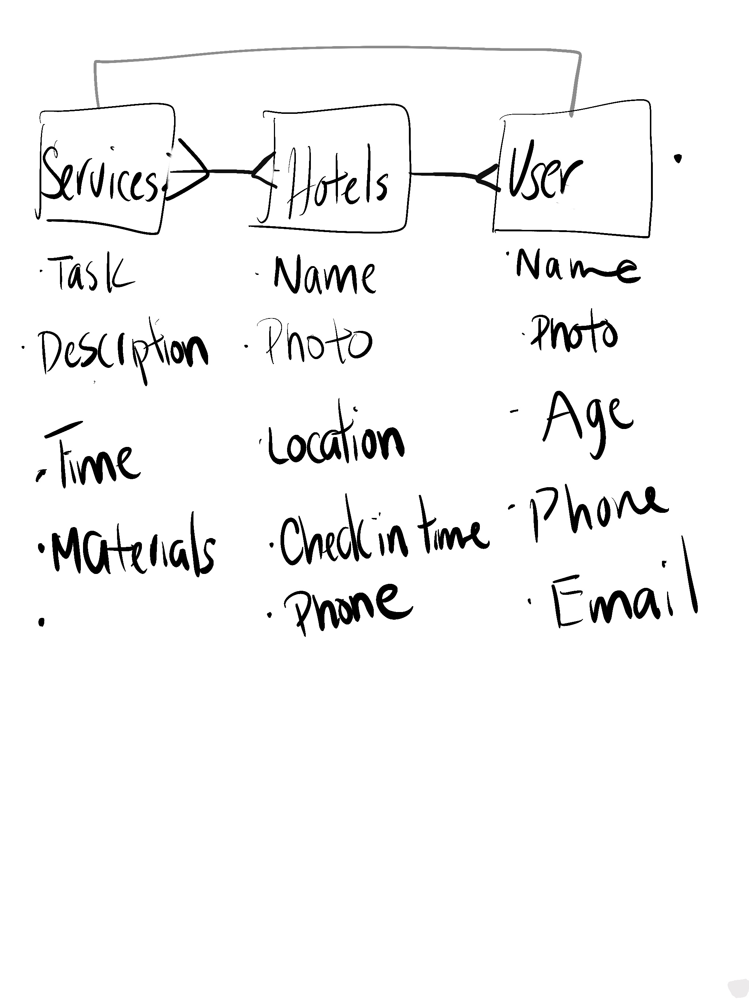

This project was created to connect people with shelter resources. Hotels are able to provide a room in return for services provided at the hotel, for example, cleaning the parking lot or exterior windows in exchange for a nights stay. There is a page where all guests, hotels and service on the platform can be viewed.

